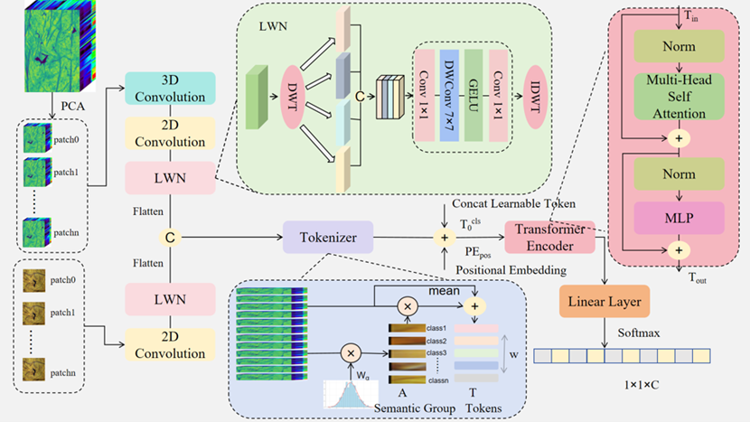

# WaveMF: A Wavelet-Enhanced Multi-Modal Spectral-Spatial Framework for Hyperspectral Imaging-Based Quality Assessment



## 📋 Abstract

WaveMF is a novel wavelet-enhanced multimodal analysis framework that fuses Hyperspectral Imaging (HSI) and RGB data for accurate quality assessment of flue-cured tobacco. The method employs a dual-branch structure to extract spectral-spatial features, with a learnable wavelet network for multi-scale feature enhancement and redundancy suppression. A hybrid modeling strategy combining convolutional operations and a lightweight transformer captures both local details and long-range dependencies.

## 🎯 Key Features

- **Dual-Branch Architecture**: Simultaneous processing of HSI and RGB data for complementary information
- **Learnable Wavelet Network**: Multi-scale feature enhancement and spectral redundancy suppression
- **Hybrid Modeling**: Combines CNN and Transformer for local and global feature extraction
- **Multi-Task Learning**: Supports six quality indicators for tobacco assessment
- **High Accuracy**: Achieves 98.97% overall accuracy on tobacco dataset

## 📊 Performance

WaveMF was evaluated on a tobacco dataset comprising 480 spectral bands and six quality indicators:

- **Overall Accuracy**: 98.97%
- **Average Accuracy**: 98.99%
- **Kappa Coefficient**: 98.70%

The framework outperforms several state-of-the-art methods in multimodal data fusion for quality assessment.

## 🔧 Requirements

```bash
torch>=1.9.0
torchvision>=0.10.0
numpy>=1.19.0
PIL>=8.0.0
einops>=0.4.0
matplotlib>=3.3.0
scikit-learn>=0.24.0
seaborn>=0.11.0
tqdm>=4.60.0
thop>=0.1.0
```

## 🚀 Installation

1. Clone the repository:
```bash
git clone https://github.com/yourusername/WaveMF.git
cd WaveMF
```

2. Create a virtual environment (optional):
```bash
conda create -n wavemf python=3.9
conda activate wavemf
```

3. Install dependencies:
```bash
pip install torch torchvision numpy einops matplotlib scikit-learn seaborn tqdm thop
```

## 🔮 Inference

Use the pre-trained models for prediction:

```bash
python Predict.py \
    --model-path WaveMF/color/best_model.pth \
    --hsi-path path/to/sample.npy \
    --rgb-path path/to/sample.png \
    --dataset color
```

### Inference Arguments

- `--model-path`: Path to the trained model checkpoint
- `--hsi-path`: Path to the HSI data file (.npy)
- `--rgb-path`: Path to the RGB image file (.png)
- `--dataset`: Specify the quality indicator classification standard for prediction

## 🏗️ Model Architecture

WaveMF consists of several key components:

1. **Dual-Branch Encoder**: Separate encoders for HSI and RGB data
2. **Learnable Wavelet Network (LWN)**: Multi-scale feature decomposition and enhancement
3. **Spectral-Spatial Feature Transformer (SSFTT)**: Captures long-range dependencies
4. **Feature Fusion Module**: Integrates multimodal features
5. **Classification Head**: Predicts quality grades

### Wavelet Block

The learnable wavelet network performs adaptive wavelet decomposition to:
- Extract multi-scale features
- Suppress spectral redundancy
- Enhance discriminative information

